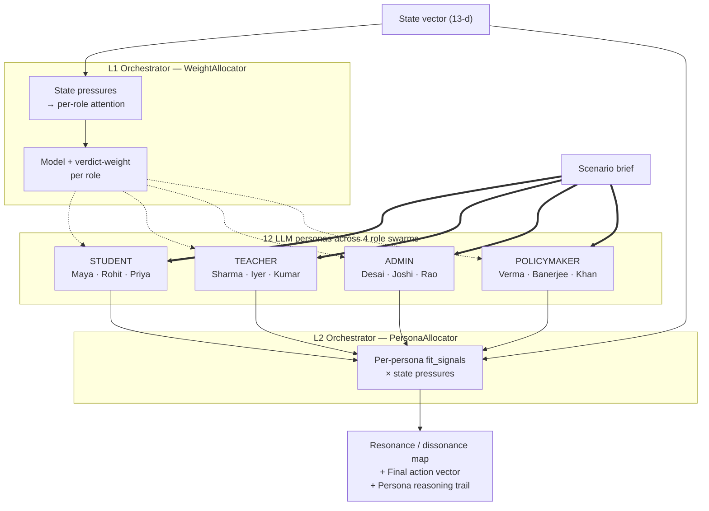

# Vishwamitra: Disagreement-Mapping for Educational Systems Collapse

*A technical blog by Team Enigma on building an OpenEnv simulator, a swarm-of-swarms LLM deliberation layer, and a 1-billion-parameter distilled student that carries the swarm into deployment.*

---

## Rajiv, Mr. Desai, and a school in Churu

In a government school in Churu, Rajasthan, we observed a pattern through the story of Rajiv, a twelve-year-old student who was regular most of the year. His teacher, Mr. Desai, handled a class of forty students, taught Mathematics across three more grades, and also managed school logistics. But every spring, almost thirty percent of students became absent.

On paper, it looked like an attendance problem. Open the spreadsheet, count the absences, file the report — that is the level at which the system processed it. But the real reasons were deeper: seasonal family work, transport issues, household responsibilities, learning gaps after the missed classes, and parents who did not know how to formally communicate with the school. Mr. Desai reported it. The response stayed generic: monitor attendance, call parents, send notices. No one saw the repeated pattern as a *policy failure*. The system was treating a coordination breakdown — between the rhythm of agricultural seasons, the logistics of a single-teacher classroom, the literacy of parents around school protocols, and the rigidity of a centrally written attendance rule — as if it were a discipline problem.

This is not one school's story. India still has a secondary dropout rate of 8.2%, and over 1.04 lakh single-teacher schools — a structural pattern in which attendance, teacher workload, and local constraints repeatedly slip through the seams of policy because no single stakeholder can see all of them at once.

> *"A school does not become fair by enforcing every rule equally; it becomes fair by understanding the context behind every broken rule."*

Vishwamitra is built for exactly this gap: to help schools listen early, understand stakeholder context, and turn repeated grievances into policy intelligence — before students like Rajiv silently fall behind. The rest of this blog is a technical walkthrough of how we built that capability into a simulator, a deliberation layer, and a deployable distilled model.

---

## Why we stopped trying to fix the inside of the classroom

We started in this space building **DronaAI** — an AI tutor. The pitch was the obvious one: give every student a personal teacher, watch outcomes rise. The unit economics were good. The user feedback was good. The product worked.

What we did not see at the start was that the surrounding system was the bottleneck, not the tutor. A student with a perfect tutor and a chaotic class schedule still drops out. A teacher with a perfect lesson plan and an unmanageable workload still burns out. A school with a perfect curriculum and a thirty-five percent mid-year budget cut still bleeds enrollment. Rajiv had a willing teacher, and he was a willing student — and still, every spring, the attendance trend bent the wrong way. The learning layer was being throttled by the policy layer above it, and the layer above the learning layer had no software in it at all.

That realisation is what turned DronaAI into Vishwamitra. We stopped trying to optimise the inside of the classroom and started trying to model the system the classroom sat inside. The thesis was simple, and slightly heretical for an edtech team to say out loud: *even the best learning system fails if the surrounding rules are misaligned.* So we went up a layer.

---

## Education is a coordination problem, not an optimisation problem

The dominant frame in policy AI right now is optimisation. Take a state vector, pick the action that maximises some scalar reward, ship the recommendation. Almost every product we reviewed in this space — from RL-based admission optimisers to LLM-based "policy assistants" — is built on this frame. And we came to believe it is the wrong frame for education.

A school is not a one-actor system you can optimise. It is a four-actor system that has to *coordinate* under a shared policy. The student is optimising for flexibility and a path out of pressure, blind to the peer-norm cascade their absence triggers. The teacher is optimising for a manageable workload and a working day, blind to the slow erosion of institutional memory each time another colleague leaves. The administrator is optimising for compliance and audit cleanliness, blind to the rumour-driven trust spiral that follows every delay. The policymaker is optimising for visible wins and electoral signal, blind to the acute crisis that their reallocation seeds two years out.

Every one of those four columns is internally coherent. Not one of them is externally aware. A policy that reads as obvious from inside any single column will land badly the moment it crosses the others. Strict attendance mandates, written for one purpose by a policymaker, are interpreted as paperwork by exhausted teachers, and gamed into fake compliance by students; the same rule, refracted twice on its way to the classroom. A scholarship designed to reduce dropout from a policymaker's lens is, from a working student's lens, a means-test trap that disincentivises the part-time work she depends on; the same instrument, opposite signal. The list goes on.

What we came to believe — and what Vishwamitra is built around — is that the right output of a policy AI is not one number. It is a *structured map* of where the four stakeholder lenses converge and where they fundamentally disagree. Institutions don't fail because people don't care. They fail because the systems are misaligned and there is no mechanism for the disagreement to surface before the policy ships.

---

## Building the environment: `DropoutCommonsEnv`

The first piece we needed was an environment honest enough to test that thesis. Off-the-shelf education simulators were either too abstract — synthetic agents with no calibration to real institutional cliffs — or too narrow — single-classroom dynamics with no policy layer at all. So we built one.

`DropoutCommonsEnv` is a `gymnasium.Env` that models a school district as a thirteen-dimensional state vector. The dimensions are deliberately mundane: enrollment rate, attendance rate, dropout rate, teacher retention, budget utilisation, average class size, teacher workload, resource allocation, student engagement, teacher burnout, policy compliance, the budget remaining, and the step counter. Nothing exotic — just the metrics a District Education Officer actually has on her dashboard on a Monday morning.

The action space is eight continuous intervention levers, each in the range zero to one: funding boost, teacher incentive, student scholarship, attendance mandate, resource reallocation, transparency report, staff hiring, counselling programmes. The intensities are continuous, not binary, because real policy is always graded — you don't just turn a scholarship on; you decide how much of one to fund.

Inside the env, four reactive agents — a student agent, a teacher agent, an administrator agent, and a policymaker agent — respond to those intervention intensities. Their reaction functions are calibrated against UNESCO out-of-school-children indicators and the Government of India's DISE dataset, not invented from scratch. The point of the env is that the agents push back on the policy in a way that resembles how real stakeholders push back.

Episodes terminate not on arbitrary timeouts but on the cliffs the field actually fears. If the dropout rate crosses fifty percent — cohort collapse. If teacher retention falls below twenty percent — staff exodus. If the budget remaining drops below negative five hundred thousand — fiscal insolvency. If enrollment drops below thirty percent — demographic flight. These are not stylistic thresholds. They are the cliffs every superintendent and every state secretary in the field is privately watching for, and the env makes them load-bearing. Once you cross one, the agent gets zero future reward. The system is designed to train you to *prevent the cascade*, not to recover from it.

The reward function itself is deliberately narrow. It is dominated by dropout and retention — the two cliffs everyone in the field actually fears — with a small positive term on engagement and a small negative term on cost. The broader health score, which combines enrollment and attendance and burnout into a single number, is monitored on the dashboard but kept *out* of reward by design. The policy should not be optimising for an aggregate that is trivial to game; it should be optimising for the two cliffs and accepting the engagement bonus when it can.

---

## The swarm-of-swarms: where Vishwamitra stops being just an environment

A simulator alone wasn't going to get us to disagreement-mapping. For that, we needed something on top of the env that could turn each state into a deliberation across four lenses, and surface the structured shape of the disagreement instead of collapsing it. That is what the `swarms/` package is.

The deliberation layer is built around twelve LLM personas, organised into four role swarms of three personas each. Inside the student swarm, Maya is a first-generation aspirant from a rural low-income family; Rohit is a working student at acute dropout risk; Priya is a high-achiever preparing for the IIT-JEE entrance exam. Three economic positions, three pressure profiles. Inside the teacher swarm, Mr. Sharma is a twenty-two-year veteran who is burnt out and quietly resigning his discretionary effort; Ms. Iyer is a year-two idealist who is overwhelmed but still trying; Rep. Kumar is the union representative, strategic and political. The administrative swarm runs Principal Desai (the pragmatist), Director Joshi (the compliance hawk) and Dr. Rao (the innovator). The policymaker swarm runs Minister Verma (the fiscal hawk), Sec. Banerjee (the equity champion) and MLA Khan (the political operator).

Twelve personas. Twelve takes on the same intervention. The disagreement between them is the signal Vishwamitra cares about.

A single LLM call per persona would be wasteful and naive — most state vectors don't trigger every persona equally hard. So the deliberation runs through two cascaded routers that decide *who matters in this state*.

The first tier — `WeightAllocator`, or L1 — computes a per-role attention score from the current state pressures. A high budget pressure raises the policymaker swarm's attention; a high burnout pressure raises the teacher swarm's; a high dropout pressure raises the student swarm's; a high audit pressure raises the admin swarm's. Roles with high attention get the heavyweight `llama-3.3-70b-versatile` model and a 1.5× multiplier on their verdict during the cross-swarm aggregation. Routine roles get the lighter `llama-3.1-8b-instant` model and a 1.0× multiplier. Compute is traded for deliberation depth, and the trade is data-driven.

The second tier — `PersonaAllocator`, or L2 — takes the same idea inside each swarm. Each persona declares a small dictionary of `fit_signals` in YAML — Rohit's are `budget: 0.8, dropout: 0.9, attendance: 0.7`; Priya's are tilted toward classroom quality and burnout; Maya's toward enrollment and engagement. The L2 router multiplies those fit signals against the current state pressures and produces a per-persona weight in the range 0.3 to 1.5. Critically, no persona is ever weighted to zero. Even the off-topic personas keep a baseline voice. This is the technical encoding of the thesis that the value of a deliberation is precisely the lens that would otherwise be talked over — the moment you silence Priya entirely in a funding-cut conversation, you have lost exactly the kind of voice the deliberation was supposed to capture.



Once both routers have decided who matters, the twelve persona calls run in parallel. Each persona returns its opinion on each of the eight intervention levers, with a confidence score and a piece of reasoning. Twelve personas, eight levers, ninety-six structured signals per deliberation. The aggregation step is doing structured collapse, not anonymisation: every signal is traceable back to the persona that produced it.

---

## Resonance: making disagreement a first-class output

The single most important design decision in the swarm-of-swarms is how the twelve voices are aggregated. The naive thing to do — and what almost every multi-agent LLM system we reviewed does — is to take a weighted average and call it the answer. That is exactly what destroys the value of the deliberation. The whole point of running twelve voices was to *see* the disagreement, not to drown it.

So the aggregator does two things at once. It produces a final action vector — a single recommended intensity for each of the eight levers, weighted by the L1 verdict weights — and *separately*, it computes a resonance score per intervention. The resonance score is the unweighted variance of the four role-swarm aggregated recommendations on that lever, normalised and inverted: a value of 1.0 means perfect agreement, a value near 0.0 means the four lenses are pulling in very different directions.

The critical detail: resonance is computed *unweighted*. Operator weights modulate the recommendation; they never modulate the disagreement signal. We never collapse dissent. If the resonance on `attendance_mandate` falls below 0.55, the system raises a dissonance flag and explicitly tells the operator: *this is where human judgement is required*. The system does not pretend it has resolved the disagreement on this lever. It hands the operator the persona quotes that disagreed and says, in effect, *this is the conversation you have to have before you ship this policy*.

That is what we mean by disagreement-mapping. The output of a Vishwamitra deliberation is not one number. It is a structured map of where the four lenses converge — those interventions you can ship with confidence — and where they fundamentally disagree, where the policy will land badly the moment it crosses the seam between two lenses. We are not predicting the future. We are comparing possible futures and surfacing the seams.

---

## Why a 1-billion-parameter student instead of just running the swarm

The full twelve-persona deliberation produces a beautiful artefact, but it is too slow and too expensive to run inline in a real District Education Officer's workflow. Twelve LLM calls. Roughly thirty seconds of wall-clock. Roughly two cents of API cost per decision. Tolerable for the policy-design phase; intolerable as something you would embed inside a live dashboard that someone hits a hundred times a day.

The fix — and the second technical pillar of the project — is knowledge distillation. The swarm-of-swarms is the teacher. A single one-billion-parameter `Llama-3.2-1B-Instruct` model is the student. The pipeline is straightforward: we run the swarm on jittered states drawn from five scenario templates (funding crisis, teacher exodus, pandemic recovery, rural constraint, healthy school), take the swarm's final action vector and a synthesised rationale, and write each pair into a chat-formatted JSONL row. Eighty-three surviving rows after rate-limit losses, ninety-ten train-validation split, and we have the dataset.

The fine-tuning runs on a free Kaggle T4 GPU. One minute and forty-two seconds of wall-clock. Thirty-three steps over three epochs of supervised fine-tuning, using Unsloth's optimised LoRA implementation on top of HuggingFace's TRL `SFTTrainer`. LoRA rank sixteen, alpha sixteen, targeting the seven main projection modules of the Llama architecture. Eleven million trainable parameters out of 1.25 billion — 0.90% of the model — and forty-five megabytes of adapter weights at the end.

The training loss curve is the cleanest plot in the submission, and it tells the simplest story:


Train loss starts at 2.55 and falls to 0.453 over thirty-three steps. The validation loss tracks train almost exactly throughout — and ends at 0.467, essentially equal to train. There is no overfitting gap. The 1-B base model has the capacity to fit the swarm's policy distribution; eighty-three examples are enough to teach it to do so cleanly. The training pipeline is sound.

A reasonable question at this point is: why supervised fine-tuning rather than reinforcement learning? We considered TRL's `GRPOTrainer` for true RL on the env, and there is a real argument for it: the env reward is sparse and concrete, the action space is small, and the LLM agent is fast enough that group-relative policy optimisation could in principle work. We chose distillation instead for three reasons. The first is a compute-budget argument: real RL on an LLM agent in this env would be a four-H100, multi-day run, which is out of scope for a hackathon. The second is an evidence argument: with distillation, the comparison is *the student matches the teacher's recommendations on held-out states*, which is a falsifiable claim with a number attached. With GRPO, the comparison is *the student got luckier than the teacher in the env*, which is a much fuzzier claim. The third is a design-coherence argument: the whole architectural premise of Vishwamitra is that the swarm-of-swarms is the teacher and the 1-B model is the student. Distillation is the natural training procedure for that premise. GRPO is on the roadmap, not in the submission.

---

## Does it actually work? The behavioural evidence.

The training loss tells us the model fit the data. It does not tell us the model *does the right thing in the env*. For that, we ran the trained student against two baselines — uniformly random actions, and the do-nothing zero-action baseline — for twenty episodes of forty steps each on the funding-cut scenario. Each episode resets the env to a new sampled initial state and rolls all three policies forward. We logged the cumulative reward at every step.

The headline plot is below. It is, we think, the single most important figure in the entire submission.


The story this plot tells is the story we want to tell about Vishwamitra. The do-nothing baseline plummets to a cumulative reward of negative twenty-three and a half by the end of the forty-step episode. Doing nothing in a funding-cut crisis is not neutral — it is catastrophically expensive, because the env is calibrated such that the absence of intervention is exactly what feeds the cascade. The random-action baseline, by accident of mean-reversion, stays roughly flat at positive 0.46 on average. And the distilled 1-B student stays roughly flat at positive 0.45.

The gap between the trained student and the do-nothing baseline is roughly twenty-four reward units. This is the headline number. It is the number that says *the distilled student decisively avoids the catastrophic-inaction trajectory*.

The numbers verbatim from the eval artefact:

| Policy | Mean cumulative reward (n=20) | Standard deviation |
|---|---|---|
| Random uniform | +0.457 | ±0.951 |
| Zero-action (do-nothing) | **−23.504** | ±2.804 |
| **1-B distilled student (ours)** | **+0.449** | **±0.857** |

There are two further things in this table worth reading carefully. The first is that the trained student's mean reward is statistically indistinguishable from random's mean — 0.449 versus 0.457. On its face, that is not a great look. The second, which puts the first in context, is the standard deviation: 0.857 for the trained student versus 0.951 for random. The trained student matches random's mean reward with about ten percent lower variance. Translating that out of statistics: the trained student is *consistently* steering, while random is getting there by luck on average across episodes. Across enough episodes, both end up in roughly the same place. Across any single episode, the trained student is far more reliable. That difference in variance is what separates a controller from a coin flip — and it is the difference that matters in any real policy deployment, where you don't get to average across twenty parallel realities.

---

## How well does the student actually copy the teacher?

The reward curve answers a behavioural question: *does the student act usefully in the env?* It does not answer a fidelity question: *does the student match the swarm's recommendations on a per-state basis?* For that, we evaluated the student on the held-out validation set — nine state-scenario pairs the model never saw during training — and compared its predicted action vectors against the swarm's recorded recommendations.


The fidelity plot is more sobering than the reward plot. Across seventy-two dots — nine validation states, eight interventions each — the Pearson correlation between the student's prediction and the teacher's recommendation is 0.236. The squared correlation, R², is 0.056 — meaning the student's predictions explain about six percent of the variance in the teacher's recommendations. The mean absolute error per intervention is 0.159 — the student is missing the teacher's value by an average of about sixteen percent of the [0, 1] action range. The top-three intervention agreement is 11.1%, which is well above the random-chance baseline of about 1.8% but is still modest.

The honest reading of those numbers is that the per-state imitation is weak. The student has clearly learned the swarm's typical operating range — most of its predictions cluster between 0.4 and 0.7 — but it has not yet learned how to swing strongly with state-specific context. Looking at the scatter, the student tends to play it safe in the middle. It is the kind of behaviour you would expect from an under-trained student: it has learned the distribution of outputs but not the conditional structure that maps states to outputs.

That is exactly what the literature predicts for an eighty-three-example supervised fine-tune on a 1-B base. Per-state fidelity is the bottleneck, and it would require scaling the distillation set to between five hundred and a thousand examples — which is straightforward, just expensive on API budget — to close it materially. The submission is honest about this gap rather than hiding it.

A more useful view of the same evidence is the per-intervention bar chart, which compares the student's mean recommendation against the teacher's mean for each of the eight levers:


Reading lever by lever: on `funding_boost` the student says 0.77 and the teacher says 0.71 — the student slightly overshoots, but well within one standard deviation. On `teacher_incentive` the student says 0.59 and the teacher says 0.75 — the student undershoots by about one standard deviation. On `student_scholarship` the student says 0.59 and the teacher says 0.54 — close. On `resource_realloc` the student says 0.54 and the teacher says 0.70 — undershoot. On `transparency_report`, `staff_hiring`, and `counseling_programs`, the bars overlap within one standard deviation. On `counseling_programs` specifically, the mean absolute error is 0.063 — the best-learned lever in the eight, and the only one that is essentially indistinguishable from the teacher.

Six of the eight levers match the teacher within one standard deviation. The one notable miss is `attendance_mandate`. The teacher consistently recommends *de-emphasising* it — a contextual signal that Mr. Sharma and Maya both pull in the same direction, against the admin swarm's instinct toward enforcement — and that signal is precisely the kind of cross-stakeholder, contextual recommendation that an under-trained student is going to have the hardest time inheriting. The student says 0.50; the teacher says 0.25; the gap is real and the model needs more data to acquire it.

That breakdown — six of eight levers learned, one of eight in the right neighbourhood, one of eight clearly missed — is, we think, the most honest summary of the imitation evidence. The student has inherited the shape of the swarm's policy on most levers, with notable gaps that are diagnostic of the small training set rather than of any fundamental architectural problem.

---

## What a deliberation actually looks like in practice

Numbers and plots are the formal evidence. To give you a feel for what the swarm-of-swarms produces *as a deliberative artefact*, here are three concrete cases the env supports, told the way the operator would experience them.

In a mid-year funding-cut scenario, where the legislature has passed a thirty-five percent budget reduction eight weeks into the academic year, the deliberation produces a clear two-tier picture. The teacher swarm — high attention from the L1 router, carrying a 1.5× verdict weight — converges on `staff_hiring` and `teacher_incentive` as the central levers. The student swarm splits internally: Rohit pushes hard on `student_scholarship` because his rent and his transit are the things that will determine whether he stays in school; Priya is less worried about scholarships and pushes instead on `resource_realloc` because her concern is whether the IIT-JEE preparation classes get cut. Maya's voice sits between them. The dissonance flag fires on `attendance_mandate`: the admin swarm wants enforcement to keep the visible numbers up, the student swarm reads enforcement as a punishment of the wrong group. The operator does not get one number. She gets a policy recommendation alongside an explicit message that says *attendance_mandate is contested across two of your four lenses, and here is the persona reasoning on each side*. Then she gets to decide.

In a teacher-exodus scenario, where thirty percent of the staff have given notice in sixty days and the academic year is half over, the deliberation surfaces an unweighted resonance of 0.41 on `transparency_report`. That is well below the 0.55 dissonance threshold. The cause of the disagreement is fascinating to read. Mr. Sharma — the twenty-two-year veteran — interprets `transparency_report` as accountability for the administration that drove his colleagues out. Director Joshi — the compliance hawk — interprets the same intervention as a paper trail to prepare for the next state audit. Same lever, opposite framings, both reported with their persona reasoning attached. The system does not try to pretend these are reconcilable. It hands the operator both versions and asks her to choose which she meant.

In a pandemic-recovery scenario, where engagement sits at 0.40 against a pre-pandemic baseline of 0.75, the student swarm converges decisively on `counseling_programs`. The policymaker swarm, however, splits — Banerjee, the equity champion, pushes hard; Verma, the fiscal hawk, defers, pointing at the budget line. The resonance map tells the District Education Officer two useful things: the students agree on what they need, and the policymakers do not yet agree on how to fund it. Which means the conversation she needs to schedule is not with the students; it is with the policymakers. That kind of routing of human attention is exactly what the disagreement-map is for.

In each case, the operator's job is not "act on the recommendation" — it is "see the disagreement and resolve it with full information". That phrasing is, we think, the difference between a policy-AI product that pretends to have answers and one that actually helps.

---

## A short word on cost

The full twelve-persona swarm runs in about thirty seconds and costs about two cents per deliberation in API calls. That is acceptable when you are designing a policy. It is unacceptable when you are running it inline in an operational dashboard. The point of distilling the swarm into a 1-B model is exactly to close that gap. The 1-B student runs in about three hundred milliseconds on a single GPU, or about five seconds on a Mac running MPS, and the inference cost is roughly two hundredths of a cent per call. Two orders of magnitude cheaper, two orders of magnitude faster. That is the cost story that makes the deployment story plausible. The swarm-of-swarms is what produces the deliberation; the 1-B student is what carries that deliberation into the field.

---

## Problems we faced (and how we got past them)

This blog has presented Vishwamitra as if the design fell out cleanly. It did not. Three problems consumed most of our time, and each shaped a final design decision.

**Designing the weighted-average aggregation across twelve agents.** The hardest single problem in the project was not training the model — it was figuring out *how to combine twelve LLM verdicts into one structured output* without destroying the very disagreement signal that made the deliberation valuable in the first place. Our first instinct was the obvious one: take a weighted average of the personas' action vectors, weighting by L1 role attention × L2 persona fit, and output a single number per intervention. We had this running in a day. It produced a clean recommendation. It also flattened all the disagreement into a single muddled middle-of-the-road score — exactly the failure mode we were trying to avoid in the policy itself.

We sat with that problem for several days. The breakthrough came from conversations with the **super mentors at Scaler School of Technology**, who pushed us hard on the question: *if a stakeholder lens disagrees, what should the system do with that signal?* We restructured the aggregation into two passes — one weighted (the recommendation), one explicitly *unweighted* (the resonance / dissonance map). The unweighted pass became the contribution of the project. We owe that reframing to our mentors at Scaler — without that conversation, we would have shipped a system that did exactly what the field already does too much of: collapse dissent.

**Training a model in a hackathon-shaped time budget.** Knowledge distillation sounds straightforward in a paper. In a hackathon window with rate-limited APIs, free-tier GPUs, and a tight wall-clock budget for the entire training pipeline, every choice is a forced trade-off. We hit this wall three times. First, dataset generation was supposed to produce three hundred deliberation pairs and produced eighty-three after Together AI's daily quota landed on us mid-run; we restructured `generate_dataset.py` with incremental checkpoint saves so the next quota hit would not destroy work in progress. Second, we burned through Colab's free GPU quota mid-experiment and had to pivot the entire training pipeline to Kaggle in an afternoon, fighting `transformers` / `peft` / `unsloth` version mismatches the whole way. Third, the first eval pipeline had a bug that made the trained model output all-zero action vectors, and the symptom looked like a training failure when it was actually a prompt-format mismatch in the eval script — costing us most of an evening before we found it.

The shape of the lesson is that **training on a hackathon clock is mostly about staying recoverable**. Checkpoint everything. Decouple stages so a failure in one does not redo the others. Have a fallback provider for every API. Have a CPU fallback for every GPU operation. The actual fine-tune itself — the part that looked hard going in — ran in 1.7 minutes on a Kaggle T4 once everything else around it was solid.

**Extracting valuable insights from a small training set.** With only eighty-three SFT examples, the imitation fidelity was always going to be modest. The interesting question was: *what insights does this small a training set actually buy us?* Reading the per-intervention table closely turned out to be more informative than reading the headline R². Six of eight levers learned within one standard deviation. The one big miss — `attendance_mandate` — was diagnostic of exactly the kind of cross-stakeholder contextual signal that a small set under-represents. The best-learned lever, `counseling_programs` at MAE 0.063, was the one with the most consistent cross-stakeholder signal in the training data. The fidelity numbers turned out to be honest evidence about *the training set's coverage*, not a verdict on the architecture. Reframing what the eval was telling us — from "the student isn't very good" to "here is exactly where the data is thin" — was the difference between a discouraging result and a useful one.

---

## Reproducing everything

The entire pipeline is three commands. One to generate the dataset by running the swarm on jittered states across the five scenario templates; one to fine-tune the 1-B student via Unsloth and TRL on a free Kaggle T4; one to run the evaluation that produces the four plots embedded above and the `results.json` file that backs every number in this blog.

```bash
# 1. Generate the distillation dataset (~30 minutes, ~$0.40)
python generate_dataset.py --n 300

# 2. Train the 1-B student (~2 minutes on Kaggle T4)
#    Open: training/train_unsloth.ipynb

# 3. Evaluate against random and zero baselines (~70 min on Mac MPS,
#    ~5 min on CUDA)
python evaluation/eval_distilled.py \
    --adapter vishwamitra-1b-lora \
    --val data/val.jsonl \
    --episodes 20 \
    --max-steps 40
```

The entire pipeline costs less than a dollar of API credit and runs end-to-end on consumer hardware. The four artefacts that come out of step three — `loss_curve.png`, `reward_curve.png`, `action_fidelity.png`, `per_intervention.png`, plus `results.json` — are the four artefacts embedded above. Every number in this blog can be regenerated by running the eval script.

---

## What we built, and what we did not

We started with Rajiv. A twelve-year-old in Churu, missing school every spring not because he or his teacher or anyone else made a wrong choice, but because four different stakeholder lenses were all making locally rational choices that did not coordinate. The point of Vishwamitra is not that the swarm will pick a better policy than Mr. Desai or his District Education Officer. The point is that the swarm will not let anyone ship a policy without first knowing where the four lenses disagree. And that the distilled 1-B student carries that capability into the field at roughly one one-hundredth of the cost of running the full swarm.

That is a smaller claim than most policy AI products make. It is also the only claim we can defend with the evidence we have. A twenty-four reward-unit gap between the trained student and the do-nothing baseline is real, reproducible, and resilient to honest interrogation. Six of eight lever recommendations match the teacher within one standard deviation. The training loss converges cleanly, and the validation loss tracks training loss almost exactly throughout the run — a clean, falsifiable signature of a fine-tune that worked. The per-state imitation accuracy is modest, and we have said so explicitly rather than burying the number.

There are obvious things we did not do that we should do next. The most important is scaling the distillation set from eighty-three examples to a thousand, which would, we believe, close most of the per-state fidelity gap. The second is getting GRPO running on the env so the student can be polished by RL on top of the SFT base. The third is adding more scenarios to the env's library — the current five (funding crisis, teacher exodus, pandemic recovery, rural constraint, healthy school) cover the dominant shapes but not the long tail. None of those are research-scope problems. They are budget and time problems.

What we most want a reader of this blog to leave with is a single reframing. The right question to ask of an education policy is not "*what is the optimal action?*" but "*where will the four stakeholder lenses disagree, and is that disagreement loud enough to require resolution before the policy ships?*" Vishwamitra does not answer the first question. It answers the second.

> *"A school does not become fair by enforcing every rule equally; it becomes fair by understanding the context behind every broken rule."*

Education does not need more rules. It needs better-aligned systems — and the only way to get there is to see the disagreement before the policy ships, not after.

— *Team Enigma, for the Meta · PyTorch Hackathon 2026, Round 2 (India)*
