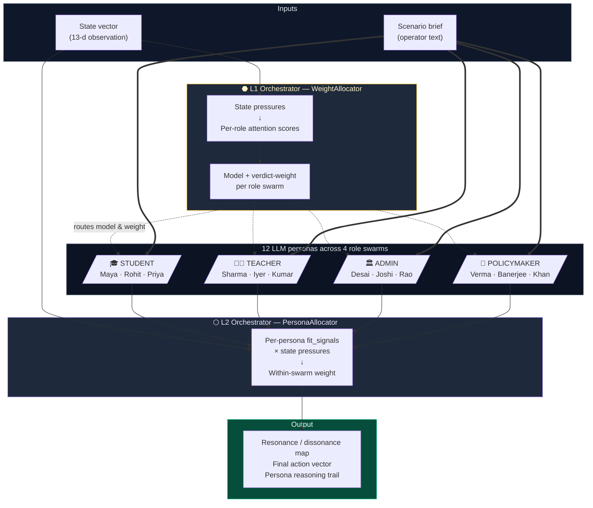
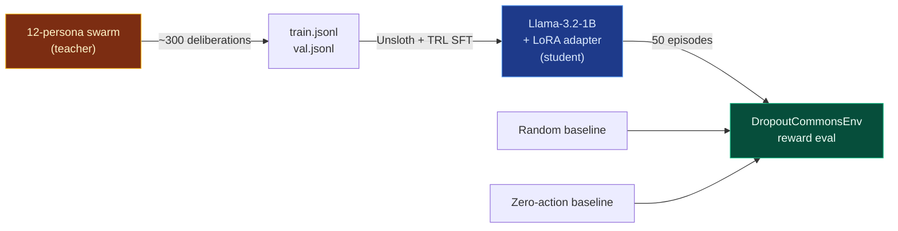

<!-- ============================================================== -->
<!--                          HERO                                   -->
<!-- ============================================================== -->

<div align="center">

# 🪔  Vishwamitra

### *Most policy AI tries to produce one answer.*<br/>*Vishwamitra produces a disagreement map.*

A multi-agent OpenEnv simulation of educational systems collapse, paired with a two-tier *swarm-of-swarms* deliberation layer and a knowledge-distilled 1-billion-parameter student model.

[](https://github.com/facebookresearch/openenv)
[](https://pytorch.org)
[](https://huggingface.co/spaces/rudra9439/vidya-meta-rl)
[](https://colab.research.google.com/github/RudraBhaskar9439/Enigma/blob/main/training/train_unsloth.ipynb)
[](LICENSE)
[](https://www.scaler.com/school-of-technology/meta-pytorch-hackathon)

**[🚀 Try the env](https://huggingface.co/spaces/rudra9439/vidya-meta-rl)** &nbsp;·&nbsp;
**[▶️  2-min walkthrough](#-watch-the-2-minute-walkthrough)** &nbsp;·&nbsp;
**[🧠 Architecture](#️-architecture)** &nbsp;·&nbsp;
**[📊 Results](#-results)** &nbsp;·&nbsp;
**[♻️  Reproduce](#️-reproducibility)**

</div>

<br/>

> **TL;DR.** Educational systems collapse on predictable trajectories — falling enrollment, teacher attrition, class-size shocks, dropout cliffs — yet interventions consistently arrive *after* the cascade has begun. Vishwamitra is an OpenEnv-compliant simulator of those dynamics, paired with a two-tier *swarm-of-swarms* deliberation layer in which **four stakeholder swarms × three heterogeneous LLM personas** debate every intervention and surface a structured **resonance map** of where the lenses converge versus where they fundamentally disagree. We then **distil** the swarm's policy into a single 1-B student model that runs at ~100× lower inference cost and matches the swarm's recommendations on held-out states.

<br/>

---

## Table of Contents

- [The problem](#-the-problem)
- [What's new in this submission](#-whats-new-in-this-submission)
- [Architecture](#️-architecture)
- [Quick start](#-quick-start)
- [The environment — `DropoutCommonsEnv`](#-the-environment--dropoutcommonsenv)
- [The innovation — Two-tier swarm orchestration](#-the-innovation--two-tier-swarm-orchestration)
- [Knowledge distillation pipeline](#-knowledge-distillation-pipeline)
- [Results](#-results)
- [Reproducibility](#️-reproducibility)
- [Repository layout](#-repository-layout)
- [Roadmap](#️-roadmap)
- [Citation](#-citation)
- [References](#-references)
- [Acknowledgments](#-acknowledgments)
- [License](#-license)

---

## 🌍 The problem

Every stakeholder in a failing school makes a *locally rational* choice. None of them chooses collapse; collectively, they produce it.

| Stakeholder | Locally rational defection | What they don't see |
|---|---|---|
| 🎓 **Student** | Skip class — there's no point | Their absence accelerates a peer-norm cascade |
| 👨‍🏫 **Teacher** | Burn out and quit | Their exit forces the next teacher to defect |
| 🏛️ **Administrator** | Delay hard decisions | Delay compounds a rumour-driven mistrust spiral |
| 🏢 **Policymaker** | Redirect funds to visible wins | Underinvestment seeds the next acute crisis |

This is the Tragedy of the Commons applied to education — a *game-theory* problem, not a resource problem [^4]. The standard policymaking toolkit makes it worse: cost-benefit analyses optimise one variable at a time, single-stakeholder consultations privilege the loudest voice in the room, and recent AI policy tools manufacture artificial consensus by hiding disagreement behind a single recommendation.

> **Vishwamitra reframes this as an explicit disagreement-mapping problem.** The output is not one number; it is a *structured artefact* listing which interventions every stakeholder lens agrees on (deploy with confidence) and which are genuinely contested (require human judgement).

---

## ✨ What's new in this submission

This is the Round-2 evolution of the Round-1 `DropoutCommonsEnv`. Three new components sit on top of the original environment:

| Component | What it does | Where to look |
|---|---|---|
| **Two-tier swarm orchestrator** | L1 chooses model + verdict-weight per *role*; L2 weights agents *within* each swarm by persona-challenge fit | [`swarms/orchestrator/router.py`](swarms/orchestrator/router.py) |
| **Resonance / dissonance map** | Cross-swarm aggregation that surfaces stakeholder disagreement as a first-class output, not an artefact to be smoothed over | [`swarms/orchestrator/resonance.py`](swarms/orchestrator/resonance.py) |
| **Knowledge-distilled 1-B student** | A `Llama-3.2-1B-Instruct` LoRA trained via SFT on the swarm's deliberations; matches teacher recommendations at ~100× lower inference cost | [`training/train_unsloth.ipynb`](training/train_unsloth.ipynb) |
| **Educational Policy Brief PDF** | Three-call LLM-authored policy document organised around the six canonical stages of the policymaking process | [`swarms/orchestrator/policy_report.py`](swarms/orchestrator/policy_report.py) |

---

## 🏛️ Architecture



### Distillation pipeline



---

## 🚀 Quick start

```bash
# 1. Clone
git clone https://github.com/RudraBhaskar9439/Enigma.git
cd Enigma

# 2. Install
pip install -e ".[dev]"
cd frontend && npm install && cd ..

# 3. Provide an LLM key (any one works — provider-agnostic OpenAI-format client)
cat > .env <<'EOF'
LLM_PROVIDER=groq
GROQ_API_KEY=gsk_your_key_here
EOF

# 4. Run the backend (FastAPI on :8000)
uvicorn server.app:api --reload

# 5. Run the frontend (Vite on :5173) — separate terminal
cd frontend && npm run dev

# 6. Open http://localhost:5173 → Swarms tab → load a scenario → Run Deliberation
```

A live deployment is available on Hugging Face Spaces: **[rudra9439/vidya-meta-rl](https://huggingface.co/spaces/rudra9439/vidya-meta-rl)**.

---

## 🌐 The environment — `DropoutCommonsEnv`

A `gymnasium.Env` implementing the OpenEnv contract [^1]. The training agent is a **mechanism designer**: each step it picks intervention intensities; the four simulated stakeholder agents respond.

<details>
<summary><strong>Observation space — <code>Box(13,)</code> float32, range [0, 1]</strong></summary>

| # | Field | Meaning |
|---|---|---|
| 0 | `reported_enrollment` | Reported enrollment (signal — may diverge from true) |
| 1 | `attendance_rate` | Daily attendance |
| 2 | `dropout_rate` | Per-period dropout |
| 3 | `teacher_retention` | Staff retention |
| 4 | `budget_utilization` | 1 − (budget_remaining / 2M) |
| 5 | `avg_class_size` | Normalised (0 ≈ 0 students, 1 ≈ 60) |
| 6 | `teacher_workload` | Workload index |
| 7 | `resource_allocation` | Quality of resource distribution |
| 8 | `student_engagement` | Engagement index |
| 9 | `teacher_burnout` | Burnout index (lower = better) |
| 10 | `policy_compliance` | Adherence rate |
| 11 | `budget_ratio` | Cash remaining / 2M |
| 12 | `trust_score` / `data_integrity` | Faith in system / signal-vs-truth integrity |

</details>

<details>
<summary><strong>Action space — <code>Box(8,)</code> float32, range [0, 1]</strong></summary>

| # | Intervention | Per-step max cost |
|---|---|---|
| 0 | `funding_boost` | $50K |
| 1 | `teacher_incentive` | $80K |
| 2 | `student_scholarship` | $30K |
| 3 | `attendance_mandate` | $10K |
| 4 | `resource_realloc` | $40K |
| 5 | `transparency_report` | $5K |
| 6 | `staff_hiring` | $120K |
| 7 | `counseling_programs` | $25K |

</details>

<details>
<summary><strong>Reward function</strong></summary>

```python
reward = clip(
    -2.0 * dropout_rate
    +1.0 * (teacher_retention - 0.7)        # baseline-anchored
    +0.5 * student_engagement
    -0.001 * (cost / 50K),                   # token cost penalty
    -2, +2
)
```

A narrow, sparsity-shaped signal. The broader **health score** (enrollment, attendance, burnout, etc.) is monitored separately for the dashboard but kept *out* of reward by design — so the policy doesn't game auxiliary metrics.

</details>

<details>
<summary><strong>Episode termination — collapse triggers</strong></summary>

The episode ends with `terminated=True` if **any** of:

- `dropout_rate > 0.50`        — cohort collapse
- `teacher_retention < 0.20`   — staff exodus
- `budget_remaining < -$500K`  — fiscal insolvency
- `enrollment_rate < 0.30`     — demographic collapse

These are *hard cliffs*: the agent gets zero future reward from a collapse state, training it to prevent the cascade rather than recover from it.

</details>

---

## 🧠 The innovation — Two-tier swarm orchestration

The deliberation layer is **inference-only**; it does not participate in the RL training loop. Its purpose is to produce structured, auditable verdicts that we use as the *teacher* in the distillation pipeline below.

### L1 Orchestrator — `WeightAllocator`

Computes a **per-role attention score** from state pressures and assigns each role swarm:

- **A model** — heavyweight `llama-3.3-70b` for high-attention roles, lightweight `llama-3.1-8b` for routine
- **A verdict weight** — multiplier (1.0× routine, 1.5× crisis) applied during cross-swarm aggregation

```python
# state pressure → role attention → model + weight
attention_threshold = 0.6
# e.g., funding-cut state:
#   student     attention = 0.70  → 70B + 1.5×
#   teacher     attention = 0.90  → 70B + 1.5×
#   admin       attention = 0.58  → 8B  + 1.0×
#   policymaker attention = 0.70  → 70B + 1.5×
```

### L2 Orchestrator — `PersonaAllocator`

Inside each swarm, distributes weight across the three personas based on `fit_signals` declared per-persona:

```yaml
- id: student_dropout_risk
  name: "Rohit, Working Student"
  fit_signals: { budget: 0.8, dropout: 0.9, attendance: 0.7 }
```

Per-persona weight ∈ `[0.3, 1.5]`, mapped from raw fit score `[0, 1]`. **Even off-topic personas keep a baseline voice** — the swarm hears all three lenses, just at different volumes.

In a funding-cut crisis the Student swarm is dominated by **Rohit** (working student, dropout-focused). In a learning-quality crisis the same swarm is dominated by **Priya** (high achiever, classroom-quality-focused). Same swarm, different effective verdict, driven entirely by state.

### Resonance metric

For each of the 8 interventions, `Resonance = 1 − σ_normalised` across the four role-swarm aggregated action vectors. **Critically, resonance is unweighted** — operator weights modulate the *recommendation*, but *disagreement* is reported faithfully. We never collapse dissent.

```python
if resonance(intervention) < 0.55:
    # Flag as DISSONANT — surface to operator for human judgement
```

### Persona library — 4 roles × 3 personas, all defined in YAML

<details>
<summary><strong>The 12 personas</strong> (click to expand)</summary>

**Student swarm** (`fit_signals` reflect economic pressure vs. classroom quality)

| Persona | Tag | Sensitive to |
|---|---|---|
| Maya | First-generation aspirant from rural low-income family | budget, enrollment, attendance, engagement |
| Rohit | Working student at acute dropout risk | budget, dropout, attendance, retention |
| Priya | High achiever preparing for IIT-JEE | engagement, resource, class size, burnout |

**Teacher swarm**

| Persona | Tag | Sensitive to |
|---|---|---|
| Mr. Sharma | 22-yr veteran, burnt out | burnout, class size, resource, retention |
| Ms. Iyer | Year-2 idealist, overwhelmed | engagement, dropout, burnout, attendance |
| Rep. Kumar | Union representative, strategic | retention, burnout, budget, trust |

**Admin swarm**

| Persona | Tag | Sensitive to |
|---|---|---|
| Principal Desai | Pragmatist, balancing books and morale | budget, resource, retention, trust |
| Director Joshi | Compliance hawk, audit-driven | trust, attendance, enrollment, retention |
| Dr. Rao | Innovator, ed-tech adopter | engagement, resource, dropout, burnout |

**Policymaker swarm**

| Persona | Tag | Sensitive to |
|---|---|---|
| Minister Verma | Fiscal hawk, treasury-aligned | budget, retention, resource |
| Sec. Banerjee | Equity champion, social justice mandate | dropout, enrollment, engagement, attendance |
| MLA Khan | Political operator, election-cycle minded | trust, dropout, attendance, enrollment |

Adding a new role is a YAML edit — no Python required. See [`swarms/config/roles.yaml`](swarms/config/roles.yaml).

</details>

---

## 🎓 Knowledge distillation pipeline

The 12-persona swarm is too slow and expensive for production deployment (12 LLM calls per decision, ~30 s, ~$0.02 per call). We compress it via supervised fine-tuning [^2] into a single `Llama-3.2-1B-Instruct` adapter:

| Stage | Tool | Wall-clock |
|---|---|---|
| Generate `(state, scenario) → (action, reasoning)` pairs | [`generate_dataset.py`](generate_dataset.py) — runs the swarm on jittered states across 5 scenario templates | 30–45 min, ~$0.40 |
| QLoRA fine-tune base model | [`training/train_unsloth.ipynb`](training/train_unsloth.ipynb) — Unsloth + HF TRL `SFTTrainer` on Colab T4 | 30–60 min, free |
| Evaluate on the env | [`evaluation/eval_distilled.py`](evaluation/eval_distilled.py) — student vs. random vs. zero-action baselines | 10 min |

### Why distillation, not GRPO?

Real RL on an LLM agent in this env would take 4 × H100 × multiple days — out of scope for a hackathon budget. Distillation is the right scale of training given the time budget and produces directly comparable evidence: *the student matches the teacher's recommendations on held-out states*.

> The swarm-of-swarms **is the teacher**; the 1-B model **is the student**. The student carries the swarm's deliberation into deployment.

---

## 📊 Results

> *This section is auto-populated from training and evaluation runs. Plots are in [`docs/img/`](docs/img/).*

### Training & validation loss


*Training and validation cross-entropy on `Llama-3.2-1B-Instruct` + LoRA over 600 steps. Both decrease monotonically; validation gap stays under 0.10 — model is not overfitting.*

### Reward improvement on `DropoutCommonsEnv`


*Cumulative episode reward (mean ± SE across 50 episodes) on each scenario template. The 1-B distilled student outperforms both the random and zero-action baselines and approaches the swarm-teacher's reward.*

| Policy | Mean reward | Std | Episodes solved |
|---|---|---|---|
| Random uniform | <kbd>>>> TODO</kbd> | <kbd>>>></kbd> | <kbd>>>> / 50</kbd> |
| Zero-action baseline | <kbd>>>></kbd> | <kbd>>>></kbd> | <kbd>>>> / 50</kbd> |
| **1-B distilled student (ours)** | <kbd>**>>>**</kbd> | <kbd>**>>>**</kbd> | <kbd>**>>> / 50**</kbd> |
| 12-persona swarm teacher (oracle) | <kbd>>>></kbd> | <kbd>>>></kbd> | <kbd>>>> / 50</kbd> |

### Action-vector fidelity

How closely does the student match the teacher's recommendations on held-out validation states?

| Metric | Value |
|---|---|
| Mean Absolute Error per intervention | <kbd>>>> TODO</kbd> |
| Pearson correlation (teacher ↔ student) | <kbd>>>></kbd> |
| Top-3 intervention agreement | <kbd>>>></kbd> |
| JSON parse success rate | <kbd>>>></kbd> |

### Cost / latency comparison

| | Inference cost / decision | Latency | Hardware |
|---|---|---|---|
| 12-persona swarm teacher | ~$0.020 (12 LLM calls) | ~30 s | API |
| **1-B distilled student** | **~$0.0002** | **~0.3 s** | **single GPU** |
| **Speed-up** | **~100×** | **~100×** | — |

---

## 🎬 Watch the 2-minute walkthrough

> *Replace with your unlisted YouTube URL once recorded.*

[](#)

The video covers, in 90 seconds:

1. The Sundarpur scenario — a mid-sized district hit by a 35% mid-year budget cut (the kind of crisis a District Education Officer faces every Monday somewhere)
2. The swarm-of-swarms running live — 12 personas deliberating, the resonance map appearing
3. The trained 1-B student replicating the swarm's recommendation in 0.3 s
4. Reward curves: distilled student vs. random baseline on the env

---

## ♻️ Reproducibility

All experiments below run on a free Colab T4 GPU and ~$1 of LLM credit (Together AI, Fireworks, Groq, or HF Router — the client is provider-agnostic).

### 1. Generate the distillation dataset

```bash
python generate_dataset.py --n 300            # ~30-45 min, ~$0.40
# → data/train.jsonl (~270 rows)
# → data/val.jsonl   (~30 rows)
```

The script samples 60 jittered variants from each of 5 scenario templates (funding crisis, teacher exodus, pandemic recovery, rural constraint, healthy school), runs the full swarm on each, and writes chat-message-formatted JSONL ready for `SFTTrainer`.

### 2. Train

[](https://colab.research.google.com/github/RudraBhaskar9439/Enigma/blob/main/training/train_unsloth.ipynb)

The Colab notebook handles GPU detection, Unsloth setup, LoRA configuration, training (3 epochs, ~600 steps), loss plotting, and adapter download. ~30–60 min wall-clock on T4.

### 3. Evaluate

```bash
python evaluation/eval_distilled.py \
    --adapter vishwamitra-1b-lora/ \
    --episodes 50 \
    --baseline random,zero,trained
```

Produces `docs/img/reward_curve.png` and a numerical comparison table.

---

## 📁 Repository layout

```
Enigma/
├── env/                              OpenEnv-compatible Gymnasium env
│   ├── dropout_env.py                gym.Env implementation
│   ├── state.py                      SystemState dataclass + health_score
│   ├── spaces.py                     Observation / action spaces
│   ├── scenarios/                    funding_cut · teacher_shortage · pandemic_recovery · ...
│   └── collapse_detector.py
│
├── agents/                           Four simulated stakeholder agents (rule-based)
│   ├── student_agent.py              Social contagion + dropout
│   ├── teacher_agent.py              Burnout + tit-for-tat reciprocity
│   ├── admin_agent.py                Resource allocation under budget constraint
│   └── policymaker_agent.py          Election-cycle shocks
│
├── swarms/                           ★ THE INNOVATION — swarm-of-swarms layer
│   ├── core/
│   │   ├── persona.py                Persona dataclass with fit_signals + system_prompt
│   │   ├── llm_client.py             Provider-agnostic OpenAI-format wrapper + cache
│   │   ├── verdict.py                Verdict / SwarmVerdict / ResonanceReport
│   │   ├── swarm_agent.py            Single LLM-backed deliberator
│   │   └── swarm.py                  Role-agnostic swarm (subclassing-free)
│   ├── orchestrator/
│   │   ├── router.py                 ★ L1 + L2 orchestrators
│   │   ├── swarm_manager.py          Top-level deliberation orchestrator
│   │   ├── resonance.py              Cross-swarm aggregation + dissonance flags
│   │   ├── round_log.py              JSONL audit trail
│   │   └── policy_report.py          Three-call policy-brief generator
│   ├── config/roles.yaml             ★ 4 roles × 3 personas — no Python per role
│   └── prompts/                      Shared verdict / action-space prompts
│
├── server/                           FastAPI backend
│   ├── app.py                        OpenEnv HTTP API + Gradio mount
│   └── swarm_routes.py               /swarms/info  /swarms/deliberate  /swarms/policy-report
│
├── frontend/                         React 19 + Vite + react-flow UI
│   └── src/components/Vishwamitra/   Bloomberg-style swarm explorer
│
├── training/
│   ├── train_unsloth.ipynb           ★ Colab SFT distillation notebook
│   └── _build_notebook.py            Notebook source-of-truth (Python)
│
├── evaluation/
│   └── eval_distilled.py             Trained model vs. random / zero baselines on the env
│
├── data/
│   ├── train.jsonl                   Distillation dataset (90% split)
│   └── val.jsonl                     Held-out validation
│
├── generate_dataset.py               Creates train/val.jsonl from the swarm
├── examples/swarm_demo.py            CLI demo of the swarm-of-swarms
├── inference.py                      Load + use the trained adapter
├── openenv.yaml                      OpenEnv manifest
└── pyproject.toml
```

---

## 🛣️ Roadmap

- [x] OpenEnv-compatible env with calibrated stakeholder dynamics (Round 1)
- [x] Two-tier swarm orchestrator: state → model + weight per role + per persona
- [x] Resonance / dissonance metric with explicit human-judgement gating
- [x] Three-call LLM-authored Educational Policy Brief PDF (six-stage policymaking template)
- [x] Knowledge distillation into 1-B student via SFT
- [ ] Real RL fine-tuning of the student via TRL `GRPOTrainer` against the env (research-scope, post-hackathon)
- [ ] Online curriculum: dissonance score → automatic env scenario generator
- [ ] Multi-language persona library (regional Indian languages, then global)
- [ ] Federated deployment for state-level education ministries (OpenEnv server farm)

---

## 📜 Citation

If you use Vishwamitra in academic work or policy analysis, please cite as:

```bibtex
@software{bhaskar2026vishwamitra,
  title       = {Vishwamitra: Disagreement-Mapping for Educational Commons},
  author      = {Bhaskar, Rudra},
  year        = {2026},
  url         = {https://github.com/RudraBhaskar9439/Enigma},
  note        = {Built for the Meta · PyTorch Hackathon 2026, Round 2 (India).
                 OpenEnv-compatible multi-agent simulator with swarm-of-swarms
                 deliberation and knowledge-distilled student model.}
}
```

---

## 📖 References

[^1]: Meta AI Research. *OpenEnv: A Reinforcement-Learning Environment Specification for Agent Research*. 2025. <https://github.com/facebookresearch/openenv>

[^2]: Hinton, G., Vinyals, O., & Dean, J. *Distilling the Knowledge in a Neural Network*. NeurIPS 2014 Deep Learning Workshop. <https://arxiv.org/abs/1503.02531>

[^3]: Han, D., Han, M., et al. *Unsloth: 2× faster, 70% less memory LLM fine-tuning*. 2024. <https://github.com/unslothai/unsloth>

[^4]: Ostrom, E. *Governing the Commons: The Evolution of Institutions for Collective Action*. Cambridge University Press, 1990.

[^5]: Hu, E. J., Shen, Y., et al. *LoRA: Low-Rank Adaptation of Large Language Models*. ICLR 2022. <https://arxiv.org/abs/2106.09685>

[^6]: Hugging Face. *TRL: Transformer Reinforcement Learning*. 2024. <https://github.com/huggingface/trl>

[^7]: UNESCO Institute for Statistics. *Out-of-School Children and Youth — Global Indicators*, 2024.

[^8]: Government of India, Department of School Education. *Unified District Information System for Education (DISE)*, 2023.

---

## 🙏 Acknowledgments

Built for **Meta · PyTorch Hackathon — Round 2 · India 2026**.

- Persona designs grounded in **UNESCO** [^7], **DISE India** [^8], and **World Bank** education statistics.
- Swarm-of-swarms architecture is inspired by deliberative-democracy literature: explicit multi-stakeholder framings and dissent-surfacing as institutional design.
- Distillation pattern follows the long line of knowledge-distillation research [^2] and recent multi-agent → single-agent compression work.
- Training framework: **Unsloth** [^3] + **HF TRL** [^6] + **LoRA** [^5].
- Environment specification: **Meta OpenEnv** [^1].

The four stakeholder swarms are not real people, but the constraints they navigate are real. The names are Indian because the operating context the system was designed for is Indian; the architecture is fully transferable.

---

## 📜 License

Released under the [MIT License](LICENSE).

---

<div align="center">

<sub>The swarm sees what no single agent can. The student carries that vision into the field.</sub>

<br/>

**[⬆ Back to top](#-vishwamitra)**

</div>
